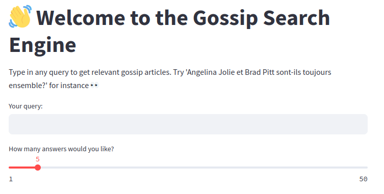
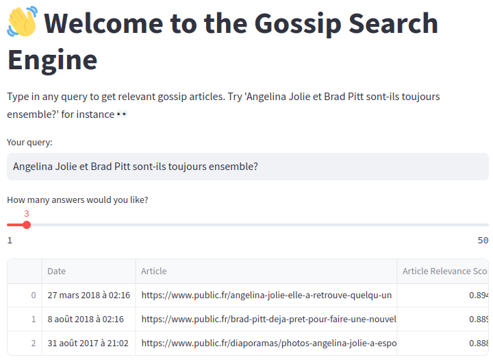
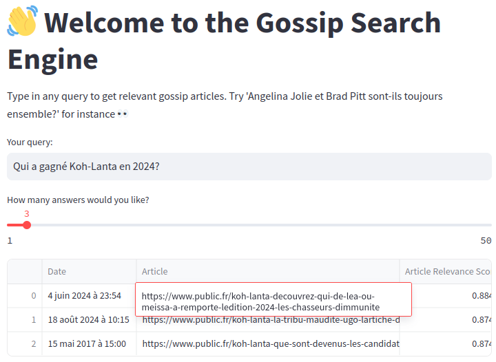
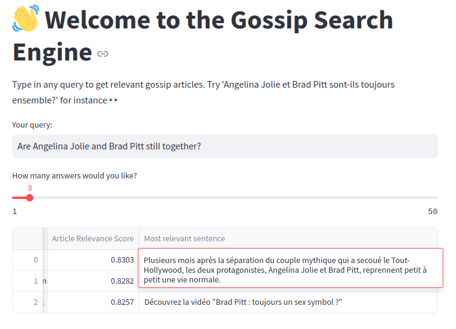

# Gossip Semantic Search



This project consists in building a system able to perform semantic search in French gossip articles available online.

The first section will get you setting up and using the application in no time.

Next comes a section containing examples.

Please keep browsing this document to find technical details for designing and implementing the search engine.

The last section comments on the search engine capabilities and discusses possible improvements.

Disclaimer: this project serves only educational purposes and as such complies with Public and VSD AI terms of use (https://www.public.fr/intelligence-artificielle, https://vsd.fr/intelligence-artificielle/)

## Running the app

The application requires an Internet connection for both installing the packages and running.

First set up a Python package environment (using `venv` or `conda` for instance).

Then install the requirements.

```
pip install -r requirements.txt
```

The application uses services requiring API keys. A `.env` file with the follwing syntax is required:
```
QDRANT_URL=XXXX
QDRANT_API_KEY=YYYY
MISTRAL_AI_API_KEY=ZZZZ
```

Finally, run the app and have fun!
```
streamlit run app.py
```
## Examples






## Implementation details

This project can be broken down into the following steps.

1) <ins>Build an index of the articles available online and find a way to automatically retrieve their content</ins>

Sitemaps are tools used by websites to boost their Search Engine Optimization (SEO). These publicly available XML files typically contain the URLs of the whole collection of domain websites.

Using `urllib` and `BeautifulSoup` Python libraries, we can get extract these information and store the list of URLs in a .csv file.

The same tools can be used to scrap the content from the articles represented by the URLs. However, it need not require storing the full content of all the articles: storing their *encodings* suffices. These encodings are the semantic representation of the articles that are useful in a search system.

That brings us to step 2.

2) <ins>Use a Language Model to encode the article contents</ins>

Language Models are able to encode the meaning of texts into numeric representations, called *embeddings*.

Embeddings can be compared to each other using distance metrics such as the *cosine similarity score*, sometimes simply called *dot product*: this score between -1 and 1 measures the semantic similarity between the underlying texts (1 being the highest possible score, -1 the worst).

This metric will help us retrieve the articles that are relevant to the user's queries.

A raging battle between AI companies is occurring at the moment to develop the most effective Language Models.

We will use Mistral AI's embedding model through its Python API to encode our articles.

3) <ins>Insert the embeddings in a Vector Database</ins>

We are able to encode the articles that we can retrieve from the Internet. Great, but what next?

We need to compute and store these embeddings once and for all, and find an efficient system to search through this collection.

Many Vector Databases offer these services. Not only do they provide efficient solutions to store and query the embeddings collections, but they also allow to search through the database using *approximate nearest neighbors* algorithms. More about these algorithms in the next step.

For this project we used the Vector Database service called Qdrant.

4) <ins>Design a method to encode user queries and search for relevant articles in the database</ins>

At this point we have a system able to scrap the content from all the online articles at *public.fr* and *vsd.fr*, encode it article by article, and store them in a database.

Now it suffices to encode the user queries as they arrive using the Language Model we have used before and search in the database for the most relevant
article.

Searching through the database requires computing similarity scores between the query embedding and all of the article embeddings, and sort these scores to retrieve the articles most relevant to the query.

The searching operation is quite time-consuming, especially when the database size increases. This is why most Vector Databases implement *approximate nearest neighbors* algorithms to scale the search with the database size. These methods allow to drastically reduce the run time while still returning relevant results.

We rely on Qdrant's searching capabilities to find articles relevant to the user queries.

5) <ins>Set up a user interface</ins>

Wrap the last step into an app to make the search engine go live!

Streamlit offers a Python library to produce such apps in a few lines of code.

## Comments and Improvements

The search engine achieves overall good results, providing with relevant results within an acceptable time (roughly a few seconds).

However, Language Models are powerful tools for text applications but they still suffer from the so-called *hallucinations*. For instance they fail to provide the sources to their results.

We chose to return the most relevant sentence from the articles as well as the publishing date of the article. These cues should help the user decide of the relevance of the results.

Nevertheless it appears that the search engine fails to encompass the timeline when processing the queries.


Other than that, it is worth mentionning that queries in English seem to work, though they are not as precise as their pending French queries (see the French query in the Examples section).



Finally, further work could include:
- comparing different searching algorithms with different distance metrics
- implement a work-around to the token limit: articles that are too long could be split and encoded in parts (Mistral AI's embedding model has a 8192 token limit which is sufficient for most of the articles)

